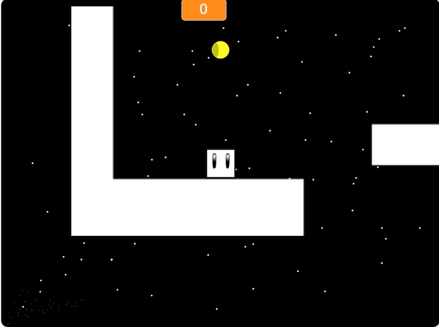
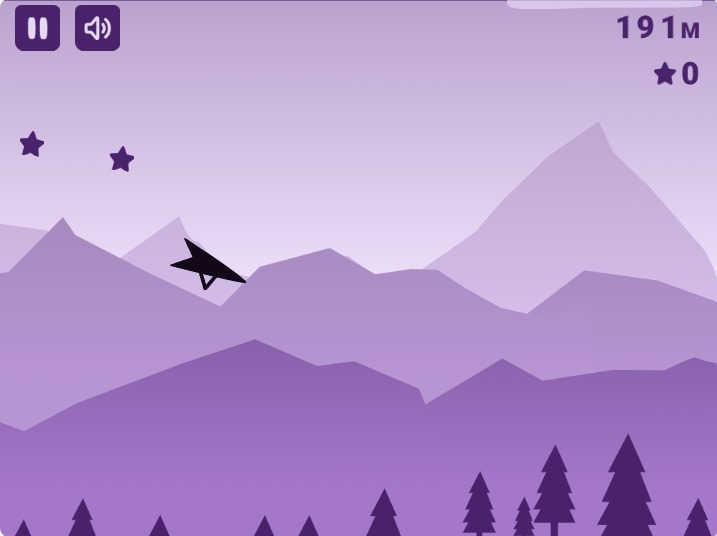
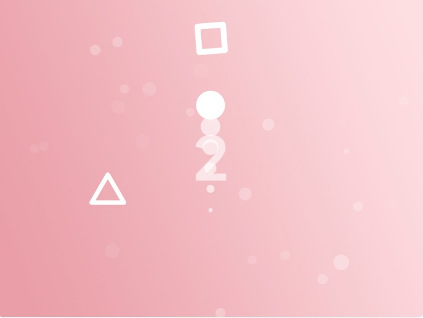
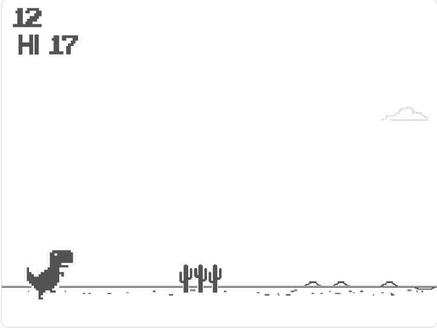
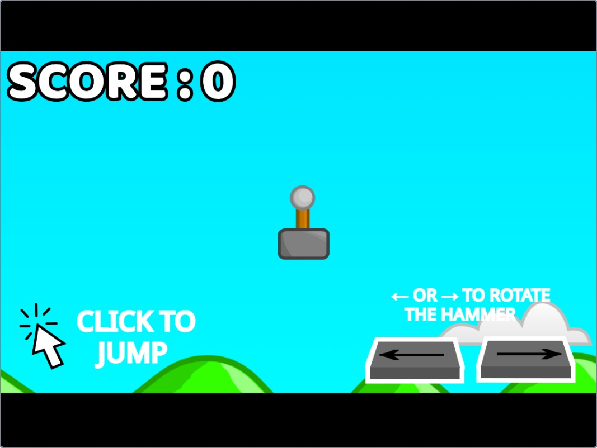
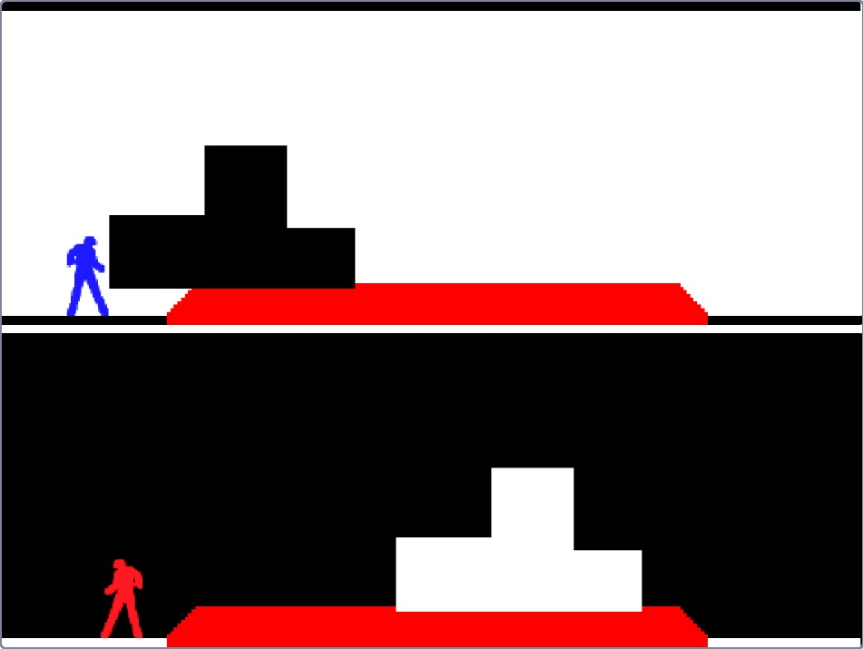
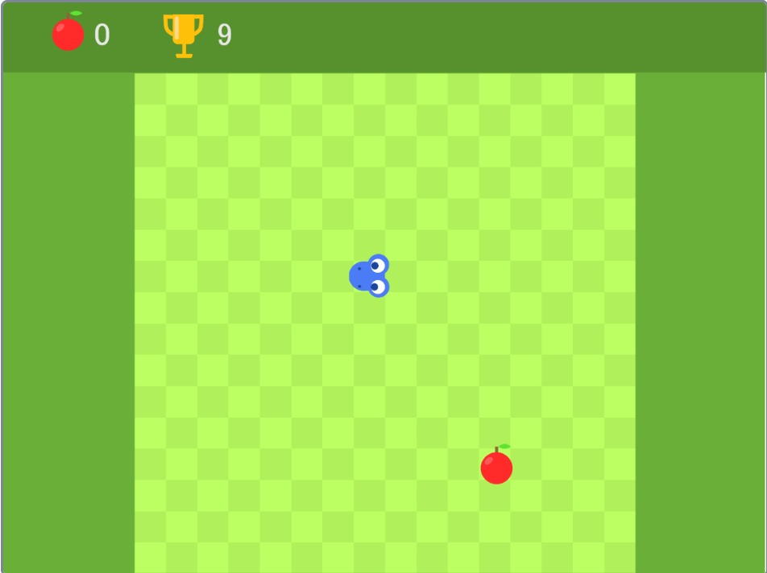
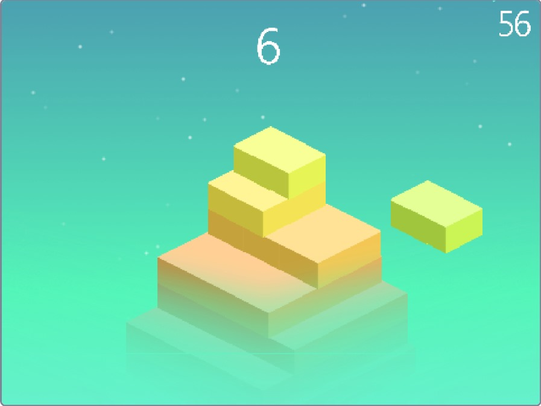

# Voice-Controlled Game Jam

Welcome to the Voice-Controlled Game Jam! Dive into the challenge of creating innovative and entertaining voice-controlled games.

Link to the Gaming Hub: https://abhi5hek001.github.io/Gaming-Hub/

## Voice-Enabled Games
### 1. Space Ninja

### 2. Glider Plane

### 3. Slow Ball

### 4. Chrome Dino

### 5. Hammer Jump

### 6. Parkour Pursuit

## Manual Games
### 7. Snake Game

### 8. Build the Stack  

## Notes for Participants
- Ensure your microphone is properly configured and working.
- Experiment with different voice tones and volumes for optimal recognition.
- Have fun, get creative, and explore the possibilities of voice-controlled gaming!

Feel free to modify, enhance, or share these games as you see fit. Happy coding, and may the best voice-controlled game win!

## Team Vishisht
- Abhishek Sahay
- Mamatha Mude
- Prajwal Kumar
- Sujal Awargand
- Rohan Vinkare